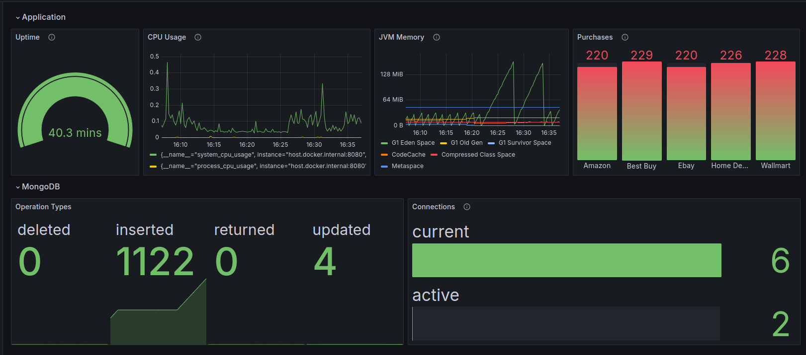

## Kotlin Micronaut and MongoDB export to Prometheus/Grafana

This application is a simple example of export metrics from a Kotlin Micronaut application with MongoDB to Prometheus and visualize them in Grafana.

### Requirements
- Docker
- Docker Compose
- Java 21
- Gradle

### Running the application
1. Clone the repository
2. Run the following commands to start the application:
```shell
cd metrics-data/ && docker compose up -d
```
```shell
./gradlew run
```
4. Send requests to insert new data to the database
It simulates some stores sending new purchases to the application
```shell
cd metrics-data/ && chmod +x requests.sh && ./requests.sh
```
5. Access Prometheus metrics:
- Application metrics at http://localhost:8080/prometheus
- MongoDB metrics at http://localhost:9216/metrics
- Prometheus dashboard: http://localhost:9090/

6. Access Grafana dashboard:
- Dashboard: http://localhost:3000/
  - Login: admin/admin
- Add new data source:
  - Type: Prometheus
  - URL: http://localhost:9090/
  - Save & Test
- Import the dashboard example from the file `metrics-data/grafana-dashboard.json`
  - May be necessary to reconfigure the visualizations 

7. Access the dashboard and see the metrics


### Stopping the application
1. Run the following command to stop the application:
```shell
cd metrics-data/ && docker compose down
```
